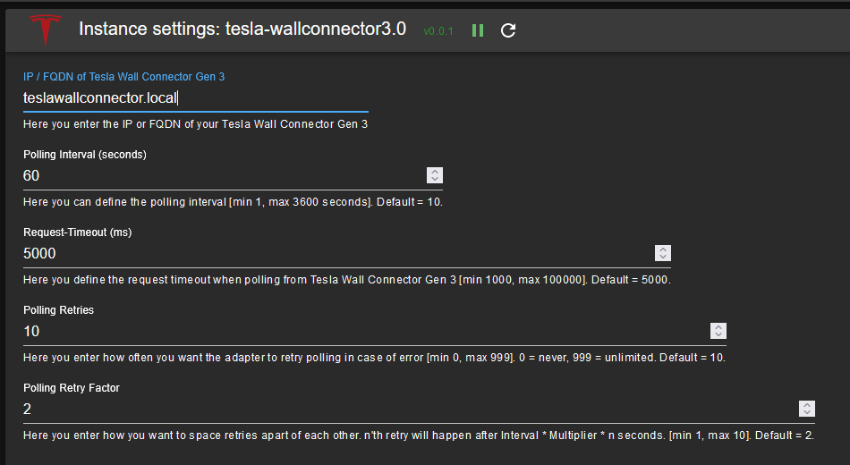

#  ioBroker.tesla-wallconnector3

**Tests:** 

## Tesla Wall Connector Gen 3 adapter for ioBroker

Reads live data from a [Tesla Wall Connector Gen 3](https://www.tesla.com/support/charging/wall-connector) on your local network. The adapter polls the wallbox API and creates ioBroker states for charging status, power, energy, temperatures, WiFi, and more.

All states are read-only (the wallbox API does not support write access).

[Documentation EN](docs/en/README.md) | [Dokumentation DE](docs/de/README.md)

## Setup

1. Install the adapter and add an instance.
2. Open the instance configuration:
   
3. Enter the IP address or hostname of your Wall Connector (e.g. `192.168.1.50` or `wallbox.local`). Enter only the bare address — no `http://`, no port, no path.
4. Adjust the remaining settings if needed (defaults work well for most setups):
   - **Polling interval** — how often to read data (default: 10 s)
   - **Request timeout** — how long to wait for a response, in milliseconds (default: 5000, range: 1000 - 10000)
   - **Retries** — how many times to retry after a failed poll (default: 10, 0 = never, 999 = unlimited)
   - **Retry factor** — spaces retries further apart; the n-th retry waits interval x factor x n seconds (default: 2)
   - **Split-phase power** — enable for North American split-phase installations
5. Click **Save & Close**. The adapter will start polling immediately.

## States

The adapter creates states under four channels. For a full reference of every state, see the [detailed documentation](docs/en/README.md).

| Channel | What it contains |
|:--------|:-----------------|
| **info** | `info.connection` — whether the adapter can reach the wallbox |
| **vitals** | Live data: charging state, vehicle connected, current, voltage, power, temperatures, alerts |
| **lifetime** | Cumulative stats: total energy, charge starts, uptime, contactor/connector cycles |
| **wifi_status** | WiFi connection: SSID, IP, MAC, signal strength, RSSI |
| **version** | Firmware version, serial number, part number |

The adapter also creates a calculated `vitals.power_w` state showing the current charging power in watts.

*Additional states may appear depending on your wallbox firmware version.*

## Disclaimer

**All product and company names or logos are trademarks™ or registered® trademarks of their respective holders. Use of them does not imply any affiliation with or endorsement by them or any associated subsidiaries! This personal project is maintained in spare time and has no business goal.**

**The default settings should be safe for normal use.** Shortening the polling interval can overload the Wall Connector's embedded web server; if the wallbox stops responding, increase the interval or stop the adapter.

**No warranty, and no liability.** This adapter is a spare-time project, provided as-is under the MIT license. It reads data from a Tesla Wall Connector over a local, undocumented API. The author accepts no liability for any consequence of using it, and cannot tell you whether using it affects your warranty or support arrangements with Tesla or your installer. If that is not acceptable to you, please do not use this adapter.

## Donate
Maintenance of this adapter can be quite time consuming. If you wish to thank the author, please use these links:

   
## Changelog
<!--
  Placeholder for the next version (at the beginning of the line):
  ### **WORK IN PROGRESS**
-->
### **WORK IN PROGRESS**
- Dependency updates

### 1.3.1 (2026-08-14)
- Dependency updates

### 1.3.0 (2026-08-04)
- Added North American split-phase power calculation mode (splitPhase setting)
- Added recovery for malformed wallbox responses (bare nan, Infinity, and truncated data)
- Added address validation: clearer error messages for misconfigured wallbox addresses
- Added 2 MiB response size limit
- Fixed connection status flapping when the wallbox was partially reachable
- Fixed charging power (power_w) sometimes showing a stale value after charging stops — now always 0 when not charging
- Fixed handling of additional malformed sensor readings from certain firmware versions
- Fixed unavailable sensor readings showing as empty instead of 0
- Fixed state types sometimes changing unexpectedly, including after adapter restart
- Fixed alerts and not-ready reasons not updating correctly when the list changes
- Fixed all data refreshing immediately after connection loss recovery
- Fixed retry count being off by one compared to the configured value
- Fixed rare state updates still happening briefly after adapter shutdown
- Fixed timeout help text showing wrong maximum (now correctly shows 10000 ms)
- Fixed wallbox requests failing on systems with an HTTP proxy configured
- Corrected WiFi signal strength metadata
- Fixed database errors no longer triggering unnecessary reconnection attempts
- Reduced load on wallbox: version data polled hourly, WiFi and lifetime data every 60 seconds
- Expanded and corrected documentation

### 1.2.0 (2026-07-20)
- (copilot) Adapter requires node.js >= 22 now
- Added IEEE 1547 CRC state attributes
- Fixed adapter checker warnings (jsonConfig, pollingTimeout)
- Replaced plain setTimeout with adapter-managed timers
- Added calculated charging power state (vitals.power_w)
- Added specific ioBroker roles for all states
- Simplified state attribute definitions
- Fixed startup recovery: adapter now retries if wallbox is unreachable at start
- Capped retry delay at 1 hour
- Fixed state attribute typos and placeholder names
- Updated documentation

### 1.1.0 (2026-03-30)
- (iobroker-bot) Adapter requires node.js >= 20 now.
- Added state attributes (and moved notifications to debug from info)
- Code optimization
- Migration to i18n

### 1.0.6 (NoBl)
* Maintenance update (dependencies, ...)

[Older changelogs can be found there](CHANGELOG_OLD.md)

## License
MIT License

Copyright (c) 2024-2026 Norbert Bluemle <github@bluemle.org>

Permission is hereby granted, free of charge, to any person obtaining a copy
of this software and associated documentation files (the "Software"), to deal
in the Software without restriction, including without limitation the rights
to use, copy, modify, merge, publish, distribute, sublicense, and/or sell
copies of the Software, and to permit persons to whom the Software is
furnished to do so, subject to the following conditions:

The above copyright notice and this permission notice shall be included in all
copies or substantial portions of the Software.

THE SOFTWARE IS PROVIDED "AS IS", WITHOUT WARRANTY OF ANY KIND, EXPRESS OR
IMPLIED, INCLUDING BUT NOT LIMITED TO THE WARRANTIES OF MERCHANTABILITY,
FITNESS FOR A PARTICULAR PURPOSE AND NONINFRINGEMENT. IN NO EVENT SHALL THE
AUTHORS OR COPYRIGHT HOLDERS BE LIABLE FOR ANY CLAIM, DAMAGES OR OTHER
LIABILITY, WHETHER IN AN ACTION OF CONTRACT, TORT OR OTHERWISE, ARISING FROM,
OUT OF OR IN CONNECTION WITH THE SOFTWARE OR THE USE OR OTHER DEALINGS IN THE
SOFTWARE.
