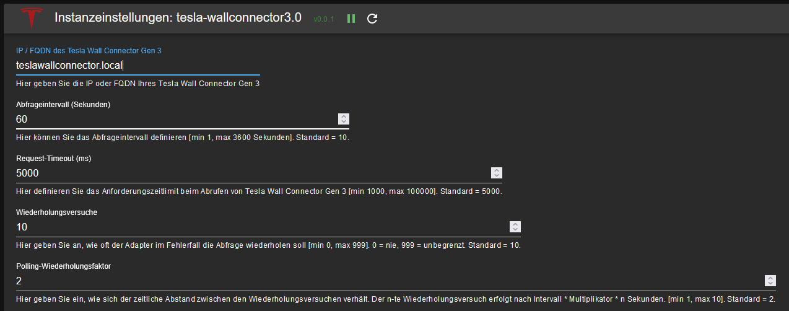

# ioBroker.tesla-wallconnector3

## Tesla Wall Connector Gen 3 Adapter für ioBroker
Ausgerichtet auf den Tesla Wall Connector Gen 3.
Bietet nur Lesezugriff auf API-Daten (Schreiben wird von der API nicht unterstützt).

## Konfiguration

### Fenster "Haupteinstellungen"

| Feld         | Beschreibung |                                                                       
|:-------------|:-------------|
|Tesla Wall Connector Gen 3    |Hier wird die IP-Adresse des gewünschten Tesla Wall Connector Gen 3 angegeben. Falls im Netzwerk ein funktionierender DNS existiert, kann auch der FQDN angegeben werden.|
|Abfrageintervall|Hier wird eingegeben, in welchen Zeitintervallen (Sekunden) die Werte vom Tesla Wall Connector Gen 3 abgerufen werden. (Default: 10 Sekunden)|
|Request-Timeout|Hier wird eingegeben, nach wievielen Millisekunden eine Anfrage spätestens vom Tesla Wall Connector Gen 3 beantwortet sein muss, bevor die Anfrage abgebrochen wird. (Default: 5000)|
|Wiederholungsversuche|Hier wird angegeben, wie oft versucht werden soll, den Tesla Wall Connector Gen 3 anzufragen, falls es zu einem Fehler kommt. (Default: 10)|
|Polling-Wiederholungsfaktor|Mit diesem Wert kann der Abstand zwischen den Wiederholungsversuchen beeinflusst werden. Es gilt: der n'te Wiederholungsversuch erfolgt nach Intervall * Multiplikator * n Sekunden nach Versuch n-1. Beispiel: Mit Standardwerten erfolgt der 1. Wiederholungsversuch 20 Sekunden nach dem initialen Versuch und der 2. Wiederholungsversuch erfolgt 40 Sekunden nach dem 1. Ein erfolgreicher Datenabruf setzt den Zähler für Wiederholungen zurück.|

Nach Abschluss der Konfiguration wird der Konfigurationsdialog mit `SPEICHERN UND SCHLIEßEN` verlassen. 
Dadurch erfolgt im Anschluss ein Neustart des Adapters.

## Datenpunkte
Alle Datenpunkte dieses Adapters sind schreibgeschützt. Der Adapter fragt die folgenden API-Endpunkte ab und erstellt für jeden zurückgegebenen Wert einen Datenpunkt:

### Kanäle

#### info
* **info.connection** (boolean) - `true` wenn der Adapter mit dem Tesla Wall Connector Gen 3 verbunden ist.

#### vitals
Live-Betriebsdaten des Wall Connectors. Die wichtigsten Datenpunkte:

| Datenpunkt | Typ | Beschreibung |
|:-----------|:---:|:-------------|
| evse_state | number | EVSE-Ladezustand (siehe Tabelle unten) |
| vehicle_connected | boolean | Ob ein Fahrzeug angeschlossen ist |
| vehicle_current_a | number | Vom Fahrzeug gezogener Strom (A) |
| session_energy_wh | number | In der aktuellen Sitzung gelieferte Energie (Wh) |
| power_w | number | Ladeleistung (berechnet aus V × A pro Phase) (W) |
| session_s | number | Dauer der aktuellen Ladesitzung (s) |
| contactor_closed | boolean | Ob das Laderelais geschlossen ist |
| grid_v | number | Netzspannung (V) |
| grid_hz | number | Netzfrequenz (Hz) |
| voltageA_v, voltageB_v, voltageC_v | number | Spannung pro Phase (V) |
| currentA_a, currentB_a, currentC_a, currentN_a | number | Strom pro Phase (A) |
| pcba_temp_c, mcu_temp_c, handle_temp_c | number | Temperaturwerte (°C) |
| current_alerts | string | Aktive Alarme |

**EVSE State-Codes:**

| Code | Bedeutung |
|:----:|:----------|
| 0 | Wallbox startet |
| 1 | Idle |
| 2 | Fahrzeug angeschlossen aber nicht bereit |
| 4 | Fahrzeug angeschlossen und bereit |
| 6 | Fahrzeug angeschlossen - Handshake läuft |
| 8 | Laden beendet / unterbrochen |
| 9 | Bereit für Laden - warte auf Fahrzeug |
| 10 | Laden mit reduzierter Leistung (weniger als 3 Phasen, je 16 Ampere) |
| 11 | Laden mit voller Leistung (3 Phasen, je 16 Ampere) |

*Hinweis: Die States 3, 5, 7, 12 sind unbekannt. Pull-Requests mit Klärungen sind willkommen!*

#### lifetime
Kumulative Lebensdauerstatistiken:

| Datenpunkt | Typ | Beschreibung |
|:-----------|:---:|:-------------|
| energy_wh | number | Gesamte gelieferte Energie (Wh) |
| charge_starts | number | Anzahl gestarteter Ladevorgänge |
| charging_time_s | number | Gesamte Ladezeit (s) |
| uptime_s | number | Gesamte Betriebszeit (s) |
| contactor_cycles | number | Anzahl der Relais-Zustandsänderungen |
| connector_cycles | number | Anzahl der Ein-/Aussteck-Zyklen |
| alert_count | number | Anzahl der Alarme |

#### version
Firmware- und Hardware-Identifikation:

| Datenpunkt | Typ | Beschreibung |
|:-----------|:---:|:-------------|
| firmware_version | string | Firmware-Version |
| serial_number | string | Seriennummer |
| part_number | string | Teilenummer |

Weitere Datenpunkte wie `git_branch`, `web_service` und IEEE 1547 CRC-Prüfsummen können je nach Firmware-Version vorhanden sein.

#### wifi_status
WLAN-Verbindungsstatus:

| Datenpunkt | Typ | Beschreibung |
|:-----------|:---:|:-------------|
| wifi_connected | boolean | Ob der WC3 mit dem WLAN verbunden ist |
| internet | boolean | Ob der WC3 Internetzugang hat |
| wifi_ssid | string | Verbundene SSID |
| wifi_infra_ip | string | IP-Adresse |
| wifi_mac | string | MAC-Adresse |
| wifi_signal_strength | number | Signalstärke (dBm) |
| wifi_rssi | number | RSSI-Wert |
| wifi_snr | number | Signal-Rausch-Verhältnis (dB) |

*Hinweis: Der Adapter erstellt dynamisch Datenpunkte für alle von der API zurückgegebenen Werte. Zusätzliche, hier nicht aufgeführte Datenpunkte können je nach Firmware-Version erscheinen.*
