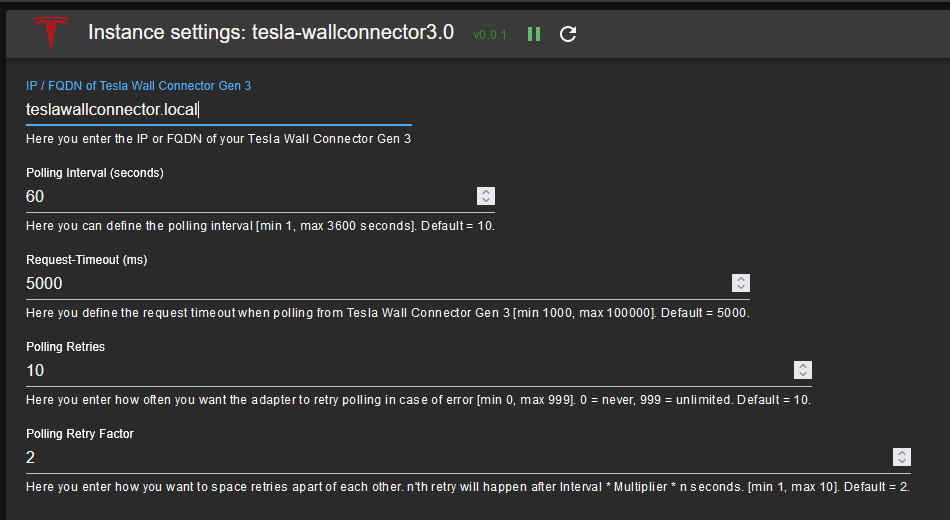

# ioBroker.tesla-wallconnector3

## Tesla Wall Connector Gen 3 adapter for ioBroker
Targeted at the Tesla Wall Connector Gen 3.
Only provides read access to API data (write isn't supported by the API).

## Setup
In addition to the adapter installation you have to add an instance of the adapter.

### Configuration 

| Field         | Description |                                                                       
|:-------------|:-------------|
|Tesla Wall Connector Gen 3 |Type in the IP-address of your Tesla Wall Connector Gen 3 (FQDN is also possible if you have a working local DNS).|
|Polling Interval|You can change the polling interval (how often the adapter reads from your Tesla Wall Connector Gen 3). (Default: 10 seconds)|
|Request-Timeout|If your network requires a higher timeout for requests sent to Tesla Wall Connector Gen 3, please change the Request-Timeout in milliseconds accordingly. (Default: 5000 milliseconds)|
|Polling Retries|In case there is an issue communicating with Tesla Wall Connector Gen 3 the adapter will retry several times. You can adjust how often it will try to read from Tesla Wall Connector Gen 3. (Default: 10)|
|Polling Retry Factor|To space retries apart a bit more you can adjust the Polling Retry Factor. (Default: 2) - Example: Using default settings the 1st retry will happen 20 seconds after the initial try, the 2nd will happen 40 seconds after the 2nd try. After each successful connect to Tesla Wall Connector Gen 3, the number of retries is reset.|

Once finished setting up configuration, hit `SAVE AND CLOSE` to leave configuration dialogue. The adapter will automatically restart.

## Usage
All states of this adapter are read-only. The adapter polls the following API endpoints and creates states for each value returned:

### Channels

#### info
* **info.connection** (boolean) - `true` if the adapter is connected to the Tesla Wall Connector Gen 3.

#### vitals
Live operational data from the wall connector. Key states include:

| State | Type | Description |
|:------|:----:|:------------|
| evse_state | number | EVSE charging state (see table below) |
| vehicle_connected | boolean | Whether a vehicle is plugged in |
| vehicle_current_a | number | Current drawn by the vehicle (A) |
| session_energy_wh | number | Energy supplied in the current session (Wh) |
| session_s | number | Duration of the current charging session (s) |
| contactor_closed | boolean | Whether the charging relay is closed |
| grid_v | number | Grid voltage (V) |
| grid_hz | number | Grid frequency (Hz) |
| voltageA_v, voltageB_v, voltageC_v | number | Voltage per line (V) |
| currentA_a, currentB_a, currentC_a, currentN_a | number | Current per line (A) |
| pcba_temp_c, mcu_temp_c, handle_temp_c | number | Temperature readings (°C) |
| current_alerts | string | Active alert details |

**EVSE State codes:**

| Code | Meaning |
|:----:|:--------|
| 0 | Booting |
| 1 | Idle |
| 2 | Connected but not ready |
| 4 | Connected and ready |
| 6 | Vehicle plugged in and handshaking |
| 8 | Charging completed/interrupted |
| 9 | Ready for charging but waiting on car |
| 10 | Charging with reduced power (less than 3 phases, 16 amps each) |
| 11 | Charging full power (3 phases, 16 amps each) |

*Note: States 3, 5, 7, 12 are unknown. Pull requests with clarifications are welcome!*

#### lifetime
Cumulative lifetime statistics:

| State | Type | Description |
|:------|:----:|:------------|
| energy_wh | number | Total energy supplied (Wh) |
| charge_starts | number | Number of charging sessions started |
| charging_time_s | number | Total charging time (s) |
| uptime_s | number | Total uptime (s) |
| contactor_cycles | number | Number of relay state changes |
| connector_cycles | number | Number of plug-in/plug-out cycles |
| alert_count | number | Number of alerts |

#### version
Firmware and hardware identification:

| State | Type | Description |
|:------|:----:|:------------|
| firmware_version | string | Firmware version |
| serial_number | string | Serial number |
| part_number | string | Part number |

Additional states like `git_branch`, `web_service`, and IEEE 1547 CRC checksums may be present depending on firmware version.

#### wifi_status
WiFi connection status:

| State | Type | Description |
|:------|:----:|:------------|
| wifi_connected | boolean | Whether the WC3 is connected to WiFi |
| internet | boolean | Whether the WC3 has internet access |
| wifi_ssid | string | Connected SSID |
| wifi_infra_ip | string | IP address |
| wifi_mac | string | MAC address |
| wifi_signal_strength | number | Signal strength (dBm) |
| wifi_rssi | number | RSSI value |
| wifi_snr | number | Signal-to-noise ratio (dB) |

*Note: The adapter dynamically creates states for all values returned by the API. Additional states not listed here may appear depending on firmware version.*
